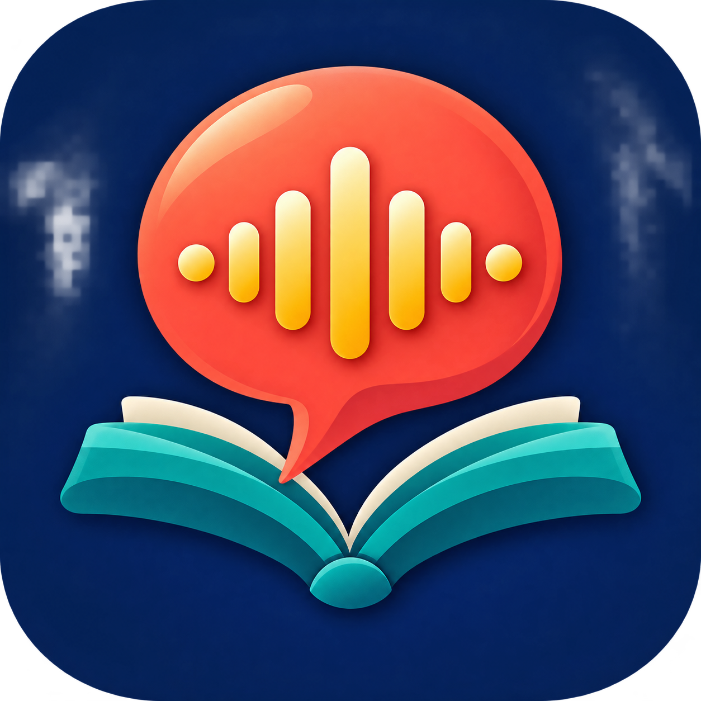

<p align="center">
  
</p>

<h1 align="center">Hola Amigo</h1>

<p align="center">
  An offline-first Android application for adult beginners learning practical Spanish.
</p>

<p align="center">
  <a href="https://github.com/julianvale818/hola-spanish-learning-app-asia/releases/latest">Android beta</a>
  ·
  <a href="docs/portfolio-entry.md">Portfolio summary</a>
  ·
  <a href="docs/privacy-policy.md">Privacy</a>
  ·
  <a href="docs/legal-notice.md">Legal notice</a>
</p>


## Product overview

Hola Amigo is an independent, AI-assisted educational technology project created for adults beginning Spanish. The current A1 beta combines curriculum, practice, reference tools, speech support, and progress tracking in one privacy-conscious Android application.

The app does not require an account and does not contain advertising, subscriptions, analytics, or an app-operated backend. Core lessons and reference content work offline. Android's installed text-to-speech service provides optional Spanish playback.

<p align="center">
  
</p>

## At a glance

| Area | Current beta |
|---|---:|
| Curriculum | 10 A1 units and 40 lessons |
| Structured exercises | 160 |
| Checkpoints | 10 unit checkpoints plus placement assessment |
| Grammar and culture | 12 concise reference guides |
| Vocabulary | 70 expressions across 10 topics |
| Interface languages | English, Japanese, Simplified Chinese |
| Exercise modes | Choice, typed response, word bank, listening, dictation, dialogue, pronunciation |
| Platform | Android 7.0+ |

## Learning experience

- CEFR-informed A1 progression organized around practical can-do outcomes
- Guided lessons, unit checkpoints, optional placement assessment, and quick practice
- Grammar and vocabulary libraries with search and topic filters
- Tap-to-hear Spanish expressions at normal or slow speed using Android device voices
- Optional speech recognition with a typed alternative
- Spaced review with Again, Hard, Good, and Easy self-ratings
- Recent-mistake practice, XP, streaks, achievement milestones, and a topic memory map
- English, Japanese, and Simplified Chinese guidance backed by structurally matched course packs
- Local JSON export and a confirmed reset option

## Product principles

1. **Focused:** Spanish only, with a clear path for adult beginners.
2. **Useful:** practical situations and comprehensible learning goals before gamification.
3. **Private:** no account, analytics, advertising, or declared internet permission.
4. **Accessible:** centered layouts, scalable Compose UI, content descriptions, non-color status cues, and typed alternatives.
5. **Transparent:** beta limitations, device-voice dependencies, and educational disclaimers are documented openly.

## Technical design

- Kotlin, Jetpack Compose, and Material 3
- Room schema 4 with explicit migrations and stable content identifiers
- Versioned JSON curriculum and reference packs
- Android text-to-speech and optional speech recognition
- Local-first learner profile, review queue, history, and export
- JVM tests, Android lint, and structural content/localization validators

Changing the interface language swaps the interface, course, and reference packs while keeping the same stable lesson and exercise IDs. This allows one local learning profile to continue across the supported guidance languages.

## Download the beta

Use the [latest GitHub release](https://github.com/julianvale818/hola-spanish-learning-app-asia/releases/latest) when available.

Two APKs are provided:

| APK | Package | Purpose |
|---|---|---|
| Compatibility update | `com.holaamigo.app` | Updates an earlier compatible beta and can preserve its local progress |
| Clean standalone | `com.holaamigo.app.standalone` | Installs beside the main package with separate, empty learning data |

The downloadable APKs are beta builds signed with a development certificate, not a Google Play production identity. Do not uninstall an older main-package build when its progress matters until an update or standalone installation has been confirmed to open.

## Build locally

Requirements:

- JDK 17
- Android SDK 35 and Build Tools 35.0.0
- Python 3 for the content validators

macOS/Linux:

```bash
./gradlew :app:testDebugUnitTest :app:lintDebug :app:assembleDebug
```

Windows:

```powershell
.\gradlew.bat :app:testDebugUnitTest :app:lintDebug :app:assembleDebug
```

Validate all localized course packs:

```bash
python tools/validate_localizations.py
python tools/validate_course.py --course app/src/main/assets/course_a1.json --reference app/src/main/assets/reference_a1.json
```

Debug APK output: `app/build/outputs/apk/debug/app-debug.apk`.

## Repository structure

```text
app/src/main/assets/                  Versioned course and reference packs
app/src/main/java/com/holaamigo/app/  Compose UI, domain, data, and speech code
app/src/test/                         JVM unit tests
app/schemas/                          Exported Room schemas
docs/                                 Product, privacy, legal, and QA documents
tools/                                Content and localization validators
```

## Verification status

For version 0.11.1:

- 64 JVM tests passed in each of the debug, release, and standalone variants
- Android lint completed with zero errors
- English, Japanese, and Simplified Chinese packs passed structural validation
- Both distributed APKs passed signature and 16 KiB-aware alignment verification
- The app declares no Android internet permission

Physical-device matrix testing, independent native-speaker review, and a complete assistive-technology audit remain open before a production claim.

## Project leadership and AI assistance

The creator defined the product direction, learner audience, curriculum architecture, pedagogical progression, feature priorities, UX requirements, editorial decisions, testing criteria, and release scope. AI tools supported implementation, drafting, iteration, localization, and quality checks under human direction and review.

See the [portfolio and CV entry](docs/portfolio-entry.md) for a concise professional description.

## Limitations

- The curriculum currently stops at A1.
- Content has not yet completed independent professional teacher and native-speaker review.
- Device voices are not a substitute for studio-recorded native-speaker audio.
- Speech recognition checks recognized words rather than phoneme-level pronunciation.
- There is no account, cloud synchronization, teacher dashboard, or cross-device restore.
- Japanese and Chinese copy still require independent native-speaker editorial review and broader device testing.
- Mastery indicators are study guidance, not certification of CEFR level or fluency.

## Rights and educational use

© 2026 Light-Seeds Productions.

This repository is source-available for portfolio review and evaluation. The unmodified application may be used free of charge for personal learning and non-commercial classroom teaching. This is not an OSI-approved open-source licence. See [LICENSE.md](LICENSE.md) and the complete [legal notice](docs/legal-notice.md).

Hola Amigo is an independent implementation. It does not use Busuu, Duolingo, Babbel, or another competitor's proprietary code, lesson content, assets, private APIs, or signing material.

